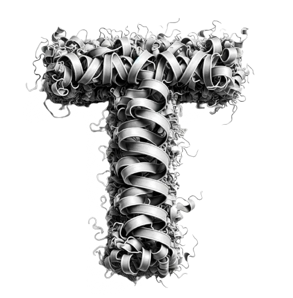
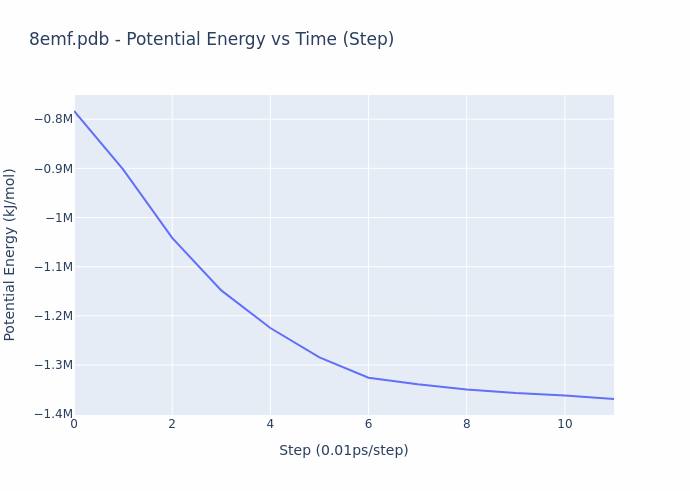

<!-- <div align="center">
    
</div> -->

<picture>
    <source srcset="./assets/macrocosmos-white.png"  media="(prefers-color-scheme: dark)">
    
</picture>

<picture>
    <source srcset="./assets/macrocosmos-black.png"  media="(prefers-color-scheme: light)">
    
</picture>

<div align="center">

# **Protein Folding Subnet 25** <!-- omit in toc -->
[](https://discord.gg/bittensor)
[](https://opensource.org/licenses/MIT) 

---

## The Incentivized Internet <!-- omit in toc -->

[Discord](https://discord.gg/bittensor) • [Network](https://taostats.io/) • [Research](https://bittensor.com/whitepaper)
</div>

This repository is the official codebase for Bittensor Subnet Folding (SN25), which was registered on May 20th, 2024. To learn more about the Bittensor project and the underlying mechanics, [read here.](https://docs.bittensor.com/)

**IMPORTANT**: This repo has a functional **testnet 141** as of May 13th. You should be testing your miners here before launching on main.

---

<div align="center">
    
</div>

# Introduction
The protein folding subnet is Bittensors’ first venture into academic use cases, built and maintained by [Macrocosmos AI](https://www.macrocosmos.ai). While the current subnet landscape consists of mainly AI and web-scraping protocols, we believe that it is important to highlight to the world how Bittensor is flexible enough to solve almost any problem.

This subnet is designed to produce valuable academic research in Bittensor. Researchers and universities can use this subnet to simulate almost any protein, on demand, for free. It is our hope that this subnet will empower researchers to conduct world-class research and publish in top journals while demonstrating that decentralized systems are an economic and efficient alternative to traditional approaches.

  
# What is Protein Folding?  
  
  Proteins are the biological molecules that "do" things, they are the molecular machines of biochemistry. Enzymes that break down food, hemoglobin that carries oxygen in blood, and actin filaments that make muscles contract are all proteins. They are made from long chains of amino acids, and the sequence of these chains is the information that is stored in DNA. However, its a large step to go from a 2D chain of amino acids to a 3D structure capable of working. 

  The process of this 2D structure folding on itself into a stable, 3D shape is called **protein folding**. For the most part, this process happens naturally and the end structure is in a much lower free energy state than the string. Like a bag of legos though, it is not enough to just know the building blocks being used, its the way they're supposed to be put together that matters. *"Form defines function"* is a common phrase in biochemsitry, and it is the quest to determine form, and thus function of proteins, that makes this process so important to understand and simulate. 

# Why is Folding a Good Subnet Idea? 
An ideal incentive mechanism defines an asymmetric workload between the validators and miners. The necessary proof of work (PoW) for the miners must require substantial effort and should be impossible to circumvent. On the other hand, the validation and rewarding process should benefit from some kind of privileged position or vantage point so that an objective score can be assigned without excess work. Put simply, **rewarding should be objective and adversarially robust**.

Protein folding is also a research topic that is of incredibly high value. Research groups all over the world dedicate their time to solving particular niches within this space. Providing a solution to attack this problem at scale is what Bittensor is meant to provide to the global community. 

# Simulation Backend and Reproducability
Moleccular dynamics (MD) simulations require a physics-based engine to run them, and SN25 utilizes the open-source project [OpenMM](https://openmm.org). As their tagline suggests, they are a "high performance, customizable molecular simulation" package. 

One of the key advantages of using OpenMM for MD-simulations is the built-in capabilities for *reproducability*. This is a key component in the reward stack and all miners should be intimately familiar with this. For more information, please read this [document](./documentation/reproducibility.md). 

# Reward Mechanism
Protein folding is a textbook example of this kind of asymmetry; the molecular dynamics simulation involves long and arduous calculations which apply the laws of physics to the system over and over again until an optimized configuration is obtained. There are no reasonable shortcuts. 

While the process of simulation is exceedingly compute-intensive, the evaluation process is actually straightforward. **The reward given to the miners is based on the ‘energy’ of their protein configuration (or shape)**. The energy value compactly represents the overall quality of their result, and this value is precisely what is decreased over the course of a molecular dynamics simulation. The energy directly corresponds to the configuration of the structure, and can be computed in closed-form. The gif below illustrates the energy minimization over a short simulation procedure.

<div align="center">
    
</div>

When the simulations finally converge (ΔE/t < threshold), they produce the form of the proteins as they are observed in real physical contexts, and this form gives rise to their biological function. Thus, the miners provide utility by preparing ready-for-study proteins on demand. An example of such a protein is shown below. 

<div align="center">
    
</div>

# Running the Subnet
## Requirements 
Protein folding utilizes an open-source package called [OpenMM](https://openmm.org). To run, you will need:
1. A Linux-based machine 
2. At least 1 CUDA-compatible GPU. We recommend an RXT 4090. 
3. Conda Distribution (we recommend [Miniconda](https://docs.anaconda.com/miniconda/)). Using conda is an [OpenMM requirement](http://docs.openmm.org/latest/userguide/application/01_getting_started.html#installing-openmm). 

For more information regarding recommended hardware specifications, look at [min_compute.yml](./min_compute.yml)

## Installation 
As a validator, you are **required** to have Weights and Biases (Wandb) active on your machine. We open-source our logging to the community, so this is a necessary component. The repo will not work without Wandb. 

As a miner, this is an optional include. As such, we do not have logic for logging natively in the base miner, but can be easily added. 

This repository requires python3.8 or higher. To install it, simply clone this repository and run the [install.sh](./install.sh) script. Below are all the steps needed to ensure that your machine is running properly:

Firstly, you must install conda: 
```bash 
mkdir -p ~/miniconda3
wget https://repo.anaconda.com/miniconda/Miniconda3-latest-Linux-x86_64.sh -O ~/miniconda3/miniconda.sh
bash ~/miniconda3/miniconda.sh -b -u -p ~/miniconda3
rm ~/miniconda3/miniconda.sh
```

```bash
pip install wandb 
wandb login

git clone https://github.com/macrocosm-os/folding.git
cd folding
bash install.sh

conda activate folding
pip install -e .
```

This will also create a virtual environment in which the repo can be run inside of.


## Registering on Mainnet
```
btcli subnet register --netuid 25 --wallet.name <YOUR_COLDKEY> --wallet.hotkey <YOUR_HOTKEY>
```

## Registering on Testnet
Netuids that are larger than 99 must be set explicity when registering your hotkey. Use the following command:
```
btcli subnet register --netuid 141 --wallet.name <YOUR_COLDKEY> --wallet.hotkey <YOUR_HOTKEY>
```

## Launch Commands
### Validator
There are many parameters that one can configure for a simulation. The base command-line args that are needed to run the validator are below. 
```bash
python neurons/validator.py
    --netuid <25/141>
    --subtensor.network <finney/test>
    --wallet.name <your wallet> # Must be created using the bittensor-cli
    --wallet.hotkey <your hotkey> # Must be created using the bittensor-cli
    --axon.port <your axon port> #VERY IMPORTANT: set the port to be one of the open TCP ports on your machine
```

As a validator, you should change these base parameters in `scripts/run_validator.py`. 

For additional configuration, the following params are useful:
```bash
python neurons/validator.py
    --netuid <25/141>
    --subtensor.network <finney/test>
    --wallet.name <your wallet> # Must be created using the bittensor-cli
    --wallet.hotkey <your hotkey> # Must be created using the bittensor-cli
    --neuron.queue_size <number of pdb_ids to submit>
    --neuron.sample_size <number of miners per pdb_id>
    --protein.max_steps <number of steps for the simulation>
    --protein.input_source <database of proteins to choose from>
    --logging.debug # Run in debug mode, alternatively --logging.trace for trace mode
    --axon.port <your axon port> #VERY IMPORTANT: set the port to be one of the open TCP ports on your machine
```

Validators are heavily recommended to run the autoprocess script to ensure that they are always up to date with the most recent version of folding. We have version tagging that will disable validators from setting weights if they are not on the correct version.
```bash
bash run_autoprocess.sh
```

### Miner
There are many parameters that one can configure for a simulation. The base command-line args that are needed to run the miner are below. 
```bash
python neurons/miner.py
    --netuid <25/141>
    --subtensor.network <finney/test>
    --wallet.name <your wallet> # Must be created using the bittensor-cli
    --wallet.hotkey <your hotkey> # Must be created using the bittensor-cli
    --neuron.max_workers <number of processes to run on your machine>
    --axon.port <your axon port> #VERY IMPORTANT: set the port to be one of the open TCP ports on your machine
```

Optionally, pm2 can be run for both the validator and the miner using our utility scripts found in pm2_configs. 
```bash 
pm2 start pm2_configs/miner.config.js
```
or 
```bash 
pm2 start pm2_configs/validator.config.js
```
Keep in mind that you will need to change the default parameters for either the [miner](./scripts/run_miner.sh) or the [validator](./scripts/run_validator.sh). 

## How does the Subnet Work?

In this subnet, validators create protein folding challenges for miners, who in turn run simulations using OpenMM to obtain stable protein configurations. At a high level, each role can be broken down into parts: 

### Validation

1. Validator creates a `neuron.queue_size` number of proteins to fold.
2. These proteins get distributed to a `neuron.sample_size` number of miners (ie: 1 PDB --> sample_size batch of miners).
3. Validator is responsible for keeping track of `sample_size * queue_size` number of individual tasks it has distributed out. 
4. Validator queries and logs results for all jobs based on a timer, `neuron.update_interval`. 

For more detailed information, look at [validation.md](./documentation/validation.md)

### Mining
Miners are expected to run many parallel processes, each executing an energy minimization routine for a particular `pdb_id`. The number of protein jobs a miner can handle is determined via the `config.neuron.max_workers` parameter. 

For detailed information, read [mining.md](./documentation/mining.md).


## License

This repository is licensed under the MIT License.
```text
# The MIT License (MIT)
# Copyright © 2024 Yuma Rao

# Permission is hereby granted, free of charge, to any person obtaining a copy of this software and associated
# documentation files (the “Software”), to deal in the Software without restriction, including without limitation
# the rights to use, copy, modify, merge, publish, distribute, sublicense, and/or sell copies of the Software,
# and to permit persons to whom the Software is furnished to do so, subject to the following conditions:

# The above copyright notice and this permission notice shall be included in all copies or substantial portions of
# the Software.

# THE SOFTWARE IS PROVIDED “AS IS”, WITHOUT WARRANTY OF ANY KIND, EXPRESS OR IMPLIED, INCLUDING BUT NOT LIMITED TO
# THE WARRANTIES OF MERCHANTABILITY, FITNESS FOR A PARTICULAR PURPOSE AND NONINFRINGEMENT. IN NO EVENT SHALL
# THE AUTHORS OR COPYRIGHT HOLDERS BE LIABLE FOR ANY CLAIM, DAMAGES OR OTHER LIABILITY, WHETHER IN AN ACTION
# OF CONTRACT, TORT OR OTHERWISE, ARISING FROM, OUT OF OR IN CONNECTION WITH THE SOFTWARE OR THE USE OR OTHER
# DEALINGS IN THE SOFTWARE.
```
