# Protein Folding API Documentation

The Protein Folding API provides endpoints for submitting and managing protein folding jobs on the Bittensor network (Subnet 25). The API consists of two main components:

1. **Folding API** - For distributing protein folding jobs across multiple validators
2. **Organic API** - For submitting jobs directly to individual validators (restricted access)

## Authentication

All endpoints use Epistula headers for request authentication. Each request must include:

- `Epistula-Version`: Must be "2"
- `Epistula-Timestamp`: Current timestamp
- `Epistula-Uuid`: Unique request identifier
- `Epistula-Signed-By`: Sender's hotkey
- `Epistula-Request-Signature`: Request signature

## Folding API

The Folding API allows researchers and developers to distribute protein folding jobs across multiple validators.

### Base URL
```
http://localhost:8029
```

### Endpoints

#### POST /fold

Submit a new folding job to be distributed across multiple validators.

**Request Body Schema:**
```json
{
  "pdb_id": "string",
  "source": "rcsb" | "pdbe",
  "ff": "string",
  "water": "string",
  "box": "cube" | "box",
  "temperature": "float",
  "friction": "float",
  "epsilon": "float",
  "validator_uids": "array[int]",
  "num_validators_to_sample": "int (optional)",
  "timeout": "int (default: 5)"
}
```

**Response Schema:**
```json
{
  "uids": "array[int]",
  "hotkeys": "array[string]",
  "status_codes": "array[any]",
  "job_id": "array[string]"
}
```

**Example Usage:**
```python
import requests
import json
from atom.epistula.epistula import Epistula

epistula = Epistula()

body = {
    "pdb_id": "1ubq",
    "source": "rcsb",
    "ff": "charmm36.xml",
    "water": "charmm36/water.xml",
    "box": "cube",
    "temperature": 300.0,
    "friction": 1.0,
    "epsilon": 0.01,
    "validator_uids": [1, 2, 3],
    "num_validators_to_sample": 3
}

body_bytes = json.dumps(body, sort_keys=True).encode('utf-8')
headers = epistula.generate_header(your_hotkey, body_bytes)

response = requests.post(
    "http://localhost:8029/fold",
    headers=headers,
    data=body_bytes
)

print(response.json())
```

## Organic API

The Organic API enables direct submission of folding jobs to individual validators. Access is restricted to whitelisted hotkeys.

### Base URL
```
http://{validator_ip}:8031
```

### Endpoints

#### POST /organic

Submit a folding job directly to a specific validator.

**Request Body Schema:**
```json
{
  "pdb_id": "string",
  "source": "rcsb" | "pdbe",
  "ff": "string",
  "water": "string", 
  "box": "cube" | "box",
  "temperature": "float",
  "friction": "float",
  "epsilon": "float"
}
```

**Response Schema:**
```json
{
  "job_id": "string"
}
```

**Example Usage:**
```python
import requests
import json
from atom.epistula.epistula import Epistula

epistula = Epistula()

body = {
    "pdb_id": "1ubq",
    "source": "rcsb",
    "ff": "charmm36.xml",
    "water": "charmm36/water.xml",
    "box": "cube",
    "temperature": 300.0,
    "friction": 1.0,
    "epsilon": 0.01
}

body_bytes = json.dumps(body, sort_keys=True).encode('utf-8')
headers = epistula.generate_header(your_hotkey, body_bytes)

validator_address = "http://validator_ip:8031"
response = requests.post(
    f"{validator_address}/organic",
    headers=headers,
    data=body_bytes
)

print(response.json())
```

## Organic API Startup Process

The Organic API is automatically started with each validator and follows this process:

1. **API Initialization**
   - Each validator starts its own Organic API instance on port 8031 (default)
   - The API is initialized only if the validator has not disabled the axon (`--neuron.axon_off`) or organic scoring (`--neuron.organic_disabled`)

2. **Address Registration**
   - The validator obtains its external IP address using a public service (checkip.amazonaws.com)
   - The full API address is constructed as: `http://{external_ip}:8031`
   - This address is registered on-chain as the validator's "commitment" using the Bittensor subtensor

3. **Address Discovery**
   - Other network participants can discover a validator's Organic API address by querying the validator's commitment on-chain
   - The commitment is automatically updated if the validator's IP address changes

Example of how a validator starts the Organic API:
```python
from folding.organic.api import start_organic_api
import requests

# Get external IP
external_ip = requests.get("https://checkip.amazonaws.com").text.strip()

# Construct API address
commitment = f"http://{external_ip}:8031"

# Register address on-chain
subtensor.commit(
    wallet=wallet,
    netuid=netuid,
    data=commitment
)

# Start the API
await start_organic_api(organic_validator, config)
```

To query a validator's Organic API address:
```python
# Get validator's commitment (API address)
validator_address = subtensor.get_commitment(netuid, validator_uid)
```

### Configuration Options

The Organic API can be configured using the following command-line arguments:

- `--neuron.axon_off`: Disables the axon and Organic API
- `--neuron.organic_enabled`: enables only organic scoring
- `--neuron.organic_api.port`: Sets the API port (default: 8031)
- `--organic_whitelist`: List of hotkeys allowed to use the Organic API

## Common Parameters

### Simulation Parameters
- `pdb_id`: The PDB identifier for the protein structure
- `source`: The source database for the PDB file (`rcsb` or `pdbe`)
- `ff`: Force field specification file (e.g., "charmm36.xml")
- `water`: Water model specification file (e.g., "charmm36/water.xml")
- `box`: Simulation box type (`cube` or `box`)
- `temperature`: Simulation temperature in Kelvin
- `friction`: Friction coefficient for the simulation
- `epsilon`: Base epsilon value for the challenge (represented as %/100)

### Folding API Specific Parameters
- `validator_uids`: List of validator UIDs to target
- `num_validators_to_sample`: Optional number of validators to sample from the provided UIDs
- `timeout`: Request timeout in seconds (default: 5)

## Error Handling

The API returns standard HTTP status codes:

- 200: Successful request
- 400: Bad request (invalid parameters)
- 403: Forbidden (authentication failure or unauthorized access)
- 429: Too many requests (rate limit exceeded)
- 500: Internal server error

## Rate Limiting

The API implements rate limiting based on the client's IP address using the `slowapi` library.

## Monitoring

The Folding API includes Prometheus metrics for monitoring through the FastAPI Instrumentator. Metrics are exposed at the `/metrics` endpoint.

## Development

The APIs are built using FastAPI and include:

- Request/Response schemas using Pydantic models
- Async request handling
- Prometheus metrics integration (Folding API)
- Rate limiting
- Structured logging
- Access control (Organic API)

For local development of the Folding API:

```bash
uvicorn folding_api.main:app --host 0.0.0.0 --port 8029 --reload
```

The Organic API starts automatically with each validator service.

## Validator Registry

The Folding API maintains a validator registry that manages the availability and selection of validators for protein folding jobs. The registry:

1. Tracks validator status and performance
2. Manages validator cooldown periods
3. Handles validator selection based on stake-weighted sampling

### Validator Selection

When submitting a job through the Folding API, validators are selected based on:

1. **Specified UIDs**: If `validator_uids` are provided and all UIDs are available in the registry, these validators will be used
2. **Random Sampling**: If no UIDs are specified or some are unavailable, validators are randomly selected based on their stake weight

### Validator Availability

Validators are considered available based on:
- Minimum stake requirement (≥ 10,000 TAO)
- Active status on the network
- Not being in a cooldown period
- Having a valid commitment address

### Cooldown Mechanism

The registry implements an exponential backoff mechanism for failed requests:
- Initial timeout: 1 second
- On failure: Timeout doubles (capped at 24 hours)
- On success: Timeout resets to 1 second

Example of validator selection and request handling:
```python
import requests
import json
from atom.epistula.epistula import Epistula

epistula = Epistula()

# Submit to specific validators
body = {
    "pdb_id": "1ubq",
    "source": "rcsb",
    "ff": "charmm36.xml",
    "water": "charmm36/water.xml",
    "box": "cube",
    "temperature": 300.0,
    "friction": 1.0,
    "epsilon": 0.01,
    "validator_uids": [1, 2, 3]  # Specific validators
}

# Or let the registry select validators
body_random = {
    "pdb_id": "1ubq",
    "source": "rcsb",
    "ff": "charmm36.xml",
    "water": "charmm36/water.xml",
    "box": "cube",
    "temperature": 300.0,
    "friction": 1.0,
    "epsilon": 0.01,
    "num_validators_to_sample": 3  # Number of validators to randomly select
}
```

## Starting the Folding API

The Folding API can be started in different network configurations. Here are the common ways to start it:

### Development/Test Network

For development or testing, start the API connected to the test network:

```bash
python folding_api/main.py \
    --netuid 141 \
    --subtensor.network test \
    --wallet.name folding_testnet \
    --wallet.hotkey your_hotkey
```

### Production Network

For production, connect to the main network (Subnet 25):

```bash
python folding_api/main.py \
    --netuid 25 \
    --wallet.name your_wallet \
    --wallet.hotkey your_hotkey
```

### Configuration Parameters

- `netuid`: The subnet ID (25 for mainnet, 141 for testnet)
- `subtensor.network`: Network to connect to (`finney` for mainnet, `test` for testnet)
- `wallet.name`: The name of your Bittensor wallet
- `wallet.hotkey`: The hotkey to use for signing requests

## API Diagram


