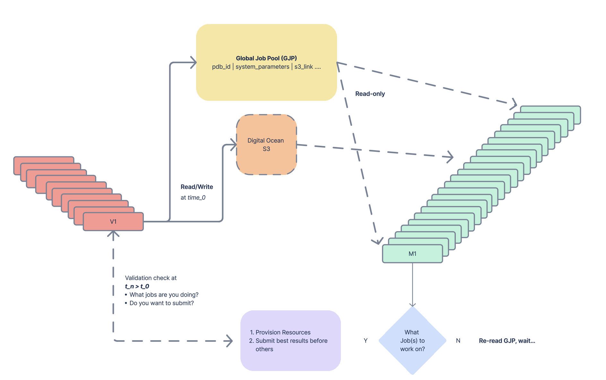

# Global Job Pool

## Overview
The **Global Job Pool** is a blockchain-integrated tool that enables decentralized job management between **validators** and **miners**. The system ensures efficient job allocation and reward distribution while maintaining transparency and security using **RQLite** for distributed database synchronization.

## Architecture
- The **Global Job Pool** is centrally hosted, allowing all participants to read job data.
- **Validators** have write access to the pool and must use an API hosted by **Macrocosmos**.
- **Miners** can only read job data but cannot write to the database.
- **RQLite** is used to ensure that any additions by a validator are automatically synchronized across all nodes.

## Features
### 1. RQLite-Powered Synchronization
- Any validator can add jobs to the pool.
- RQLite ensures all nodes automatically sync with the latest job data.

### 2. Miner Job Execution & Reward System
- Miners work on jobs from the pool to earn rewards.
- Performance-based rewards: Higher-ranked miners earn greater rewards.
- Rewards are distributed using a **top-k reward distribution** model.

### 3. Controlled Job Submission
- Miners can only submit a result **once** per job.
- A submission can only occur when a **validator requests** it from the miner.

### 4. Job Prioritization
- Each job has an assigned **priority level**. Higher-priority jobs offer greater rewards. 

## Access Control
| Role        | Read Access | Write Access | API Required |
|------------|------------|-------------|--------------|
| **Validators** | ✅ | ✅ | ✅ (Provided by Macrocosmos) |
| **Miners** | ✅ | ❌ | ❌ |

## Visualization 

## Future Enhancements
- Extended miner analytics to optimize reward distribution.
- Dynamic priority adjustments based on network demand and Organics.

## Installation & Usage
Instructions for setup and API usage will be provided by **Macrocosmos** to all validators. If you have not been messaged, please contact the SN25 team.

For further inquiries, please contact **Macrocosmos Support**.

