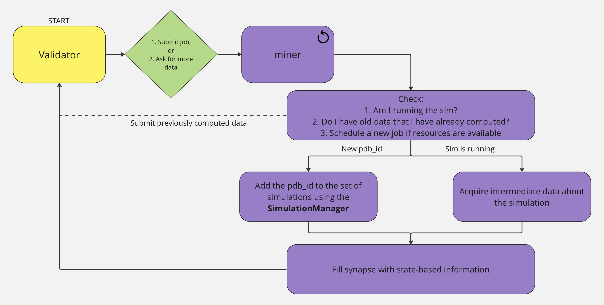

# Mining Procedure
Miners are now required to use GPU hardware for energy minimization simulations. Protein folding is a computationally intensive task. There are no shortcuts, and as such miners are rewarded truly on their ability to find the best configuration for their protein. 

Participants are encouraged to explore the trade-off between parallell processing and dedicating all compute power to a single simulation. Limiting the number of active simulations allows miners to focus on finding the best configuration for a single protein without the overhead of managing multiple tasks.

## Job Scheduling
The miner is responsible for running a `config.neuron.max_workers` number of pdb_id jobs, where these jobs are launched via the miner-specific logic. The flow is below: 

    

## Using the Global Job Pool (GJP)
The GJP allows miners to choose their own work rather than being delegated jobs from validator queries. The base miner (`folding/miners/folding_miner.py`) is designed to use the global job pool to fetch job information, prepare simulations, and execute them. 

The GJP is built using RQLite and can be accessed by starting a read node, which is done automatically in the `BaseNeuron`.  Please be sure to create a `.env` file (using `.env.example` as a reference) and fill it with your respective variables. Please note miners do not need to set any of the `S3` variables. Set `RQLITE_HTTP_ADV_ADDR` and `RQLITE_RAFT_ADV_ADDR` with the public IP of your machine. It is recommended to use the default rqlite ports `4001, 4002`, but not required; Just ensure that the ports you choose are open. Please set the `HOTKEY` variable to the hotkey ss58 address of your miner. 

The following varibles can be copied from `.env.example` to your `.env` file without modification:
- `RQLITE_HTTP_ADDR`
- `RQLITE_RAFT_ADDR`
- `JOIN_ADDR`

Once the connection to rqlite is made through the read node, a local snapshot of the GJP will appear in `/db`. In this directory, navigate to `db.sqlite` to examine the table. There are some functions available in `/scripts/query_rqlite.py` that will allow you to pull data from the table for processing. 

Currently, the base miner uses the read node API to fetch job information from the global job pool, rather than using the local snapshot. This is to ensure you have the most up-to-date information. 

## Running the base miner `FoldingMiner`

The base miner is launched in a `pm2` process with the following command: `pm2 start pm2_configs/miner.config.js`.