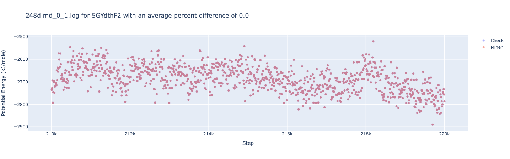
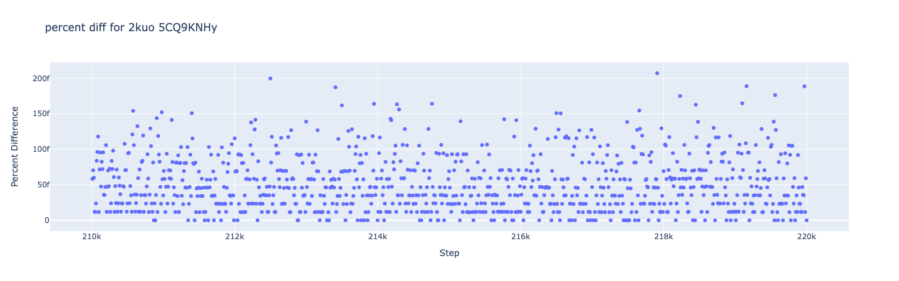

# Reproducibility in OpenMM

The biggest challenge for this subnetwork is verifying if miners are running simulations with the correct system parameters. This is important so we can secure the future of the network by being able to create a product that is reliable and accurate. The biggest reason we moved to OpenMM is due to the feature called `DeterministicForces`, which allows us to run the same simulation on different machines and get the same results. This is a huge step forward in the right direction. There is a caveat though, reproducibility is not 100% consistent yet as of our testing. From what we know now, reprod is sensitive to: 

1. The pdb that was chosen for the simulation, 
2. The hardware it is run on. 

With these points in mind, if we find that your run was not reproducible, your submission **WILL NOT** be accepted.

In order to get as close as possible to stability, we will require **ALL** validators to run the same GPU. Therefore, as a **miner**, one guaranteed way to have 100% chance of a reproducible simulation is to run the same exact hardware. Below I provide some analysis that we did during our testnet phase to show how reproducibility can be affected by different hardware.

## Reproducibility Analysis

#### Same hardware
We ran the same simulation on 2 different machines with the same exact hardware. The results were identical. This is the ideal scenario and what we are aiming for:

As you can see the graph shows that all points are perfectly aligned. This is what we are aiming for. This can be shown more clearly by calculating the percentage difference between the two simulations at each step. The percentage difference is 0% for all points:

#### Different hardware
We ran the same simulation on 2 different machines with different GPUs. The simulations should still look nearly identical as shown below: 

Looking at only this plot it seems like the simulations are identical. However, when we calculate the percentage difference between the two simulations at each step, we see that the percentage difference is not 0% for all points:

As you can see, the percentage difference is not 0% for all points. This is not ideal but it is still acceptable. We will allow for some variation in the simulations but if the percentage difference is too high, we will not accept the submission.

## Failures in reproducibility
We observed that in some cases the simulations were not reproducible at all. We are still investigating the cause of this, so far we have identified 2 types of failures

### Type 1: Small deviations
In this case, the simulations are not reproducible but the percentage difference is not too high. These type of simulations are not acceptable and we will be investigating what causes them. Here's an example of a simulation that has small deviations:

These type of simulations usually cap at around 5% difference per step:

### Type 2: Large deviations
In this case, the simulations are not reproducible and the percentage difference is very high. These type of simulations are not acceptable and we will be investigating what causes them. Here's an example of a simulation that has large deviations:

Percentage difference:

Such major deviations are unusual and indicate the presence of a major underlying issue. 

## Conclusion
We are still investigating the cause of these failures. We will be requiring all validators to run the same exact GPUs to ensure simulation reproducability. If you notice that as a miner you're runs are falsely marked as invalid due to a lack of reproducibility please reach out to us. We will not accept submissions that are not reproducible.
