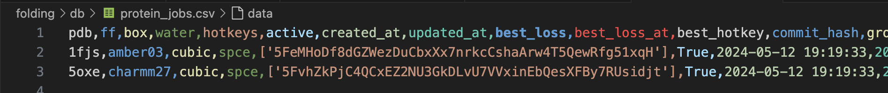

# Validation Procedure 

Similarly to other subnets, the protein folding validator is responsible for submitting jobs to the set of miners that are on the network.

1. We require validators to run an on a specific GPU (A5000) to enforce reproducability. 
2. The validator has the non-trival task of scheduling, monitoring, and closing jobs that have been submitted to miners. More on this below.

## Searching for Protein Folding Configurations 
As a researcher, determining what hyperparameters to run for a protein folding simulation is very ill-posed. There are many factors that need to be considered when choosing these parameters, but ultimately researchers like to do a "parameter sweep" of potential hyperparameters that could lead to stable solutions for a particular protein (otherwise known as a `pdb_id`). As such, the validator implements this search methodology. 

1. From a large set of possible `pdb_ids`, select a single set of hyperparams (this is done in [hyperparameters.py](../folding/validators/hyperparameters.py)).
2. Attempt to run a small-scale simulation with this hyperparameter set
3. If it breaks, go to the next possible hp set
4. If it doesn't, submit this `pdb_id` to the miner with the associated hp configuration.
5. Log this job into the `protein_jobs.csv`.  

Once the above procedure is done, the flow chart below outlines the rest of the procedure:

    

Once the miner has recieved the protein, the validator can query the miner at any frequency to obtain intermediate results from the miner. This is important for the following reasons:

1. Miners are graded periodically. This means that if 10 miners were given this job, every miner has the opportunity to obtain rewards for their work, rather than the best final step being rewarded. 
2. On each step, the validator **MUST** log the progress of their jobs over time for the set of hotkeys they have queried. Validators will record this information in a database called `protein_jobs.csv`, which is created automatically. Below is an example of the first few elements of the db. 

    

